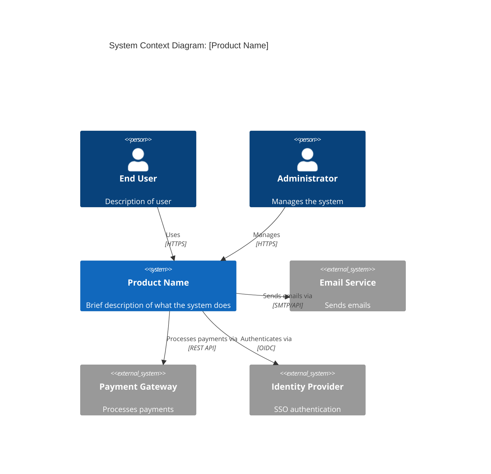
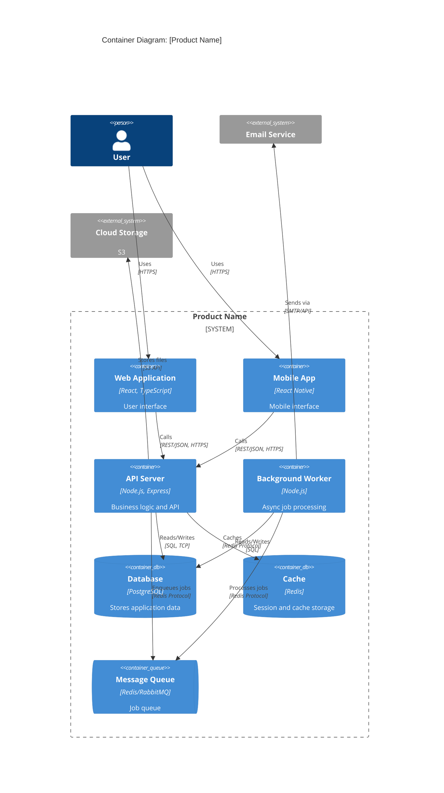
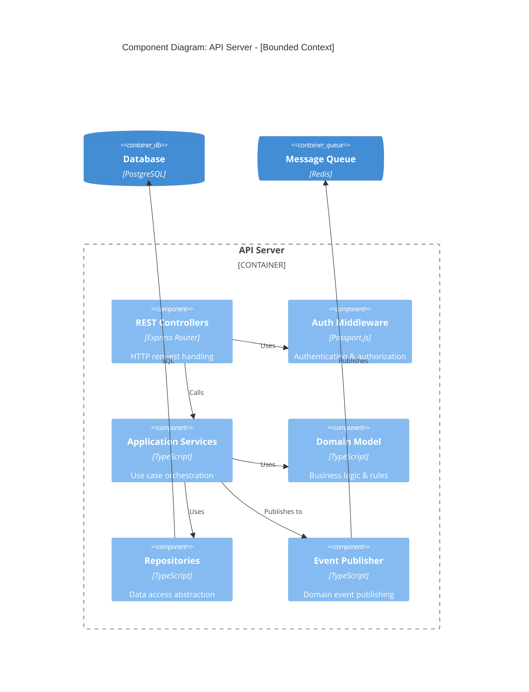

# C4 Model Guidelines

Справочник по C4 Model для idea2prd skills.

## Overview

C4 Model — иерархический подход к визуализации архитектуры:

```
Level 1: System Context  — Система и её окружение
Level 2: Container       — Высокоуровневые компоненты системы
Level 3: Component       — Компоненты внутри контейнера
Level 4: Code            — Классы/модули (обычно не нужен)
```

## Level 1: System Context

**Цель:** Показать систему в контексте пользователей и внешних систем.

**Что включать:**
- Основные пользователи (personas)
- Вашу систему (один блок)
- Внешние системы (интеграции)
- Связи между ними

**Mermaid Template:**



**Правила:**
- Максимум 10-15 элементов
- Показывать только ключевых пользователей
- Группировать похожие внешние системы
- Указывать протокол/формат связи

---

## Level 2: Container Diagram

**Цель:** Показать высокоуровневую структуру системы.

**Что включать:**
- Приложения (web app, mobile app, CLI)
- Сервисы (API, workers, microservices)
- Базы данных
- Очереди сообщений
- Файловые хранилища

**Mermaid Template:**



**Container Types:**

| Type | Mermaid | Example |
|------|---------|---------|
| Application | `Container` | Web app, API, Worker |
| Database | `ContainerDb` | PostgreSQL, MongoDB |
| Queue | `ContainerQueue` | RabbitMQ, Redis Queue |
| External | `System_Ext` | Third-party APIs |

**Правила:**
- Один Container = один deployable unit
- Показывать технологии
- Указывать протоколы связи
- Группировать в System_Boundary

---

## Level 3: Component Diagram

**Цель:** Показать внутреннюю структуру контейнера.

**Когда создавать:**
- Для Core bounded contexts (обязательно)
- Для сложных контейнеров
- Когда нужна детализация для разработки

**Mermaid Template:**



**Layered Architecture Components:**

```
┌─────────────────────────────────────────┐
│           Controllers/Routes            │  ← HTTP handling
├─────────────────────────────────────────┤
│          Application Services           │  ← Use case orchestration
├─────────────────────────────────────────┤
│             Domain Model                │  ← Business logic
├─────────────────────────────────────────┤
│        Repositories / Gateways          │  ← Data access
└─────────────────────────────────────────┘
```

**Правила:**
- Один diagram per Bounded Context
- Показывать слои архитектуры
- Указывать направление зависимостей
- Не более 15 компонентов

---

## Mapping to Bounded Contexts

**Правило:** Один Container может содержать multiple Bounded Contexts, или один Bounded Context может span multiple Containers.

**Modular Monolith:**
```
Container: API Server
├── Bounded Context: Orders
│   └── Components: OrderController, OrderService, OrderRepository
├── Bounded Context: Catalog
│   └── Components: CatalogController, CatalogService, CatalogRepository
└── Bounded Context: Identity
    └── Components: AuthController, UserService, UserRepository
```

**Microservices:**
```
Container: Order Service    → Bounded Context: Orders
Container: Catalog Service  → Bounded Context: Catalog
Container: Identity Service → Bounded Context: Identity
```

---

## Mermaid Syntax Reference

### Elements

```mermaid
%% Persons
Person(alias, "Label", "Description")
Person_Ext(alias, "Label", "Description")

%% Systems
System(alias, "Label", "Description")
System_Ext(alias, "Label", "Description")

%% Containers
Container(alias, "Label", "Technology", "Description")
ContainerDb(alias, "Label", "Technology", "Description")
ContainerQueue(alias, "Label", "Technology", "Description")

%% Components
Component(alias, "Label", "Technology", "Description")

%% Boundaries
System_Boundary(alias, "Label") { ... }
Container_Boundary(alias, "Label") { ... }

%% Relationships
Rel(from, to, "Label")
Rel(from, to, "Label", "Technology")
Rel_D(from, to, "Label")  %% Down
Rel_U(from, to, "Label")  %% Up
Rel_L(from, to, "Label")  %% Left
Rel_R(from, to, "Label")  %% Right
```

### Styling

```mermaid
%% Update styles
UpdateElementStyle(alias, $bgColor="blue", $fontColor="white")
UpdateRelStyle(from, to, $textColor="blue", $lineColor="blue")
```

---

## Best Practices

1. **Start at Level 1** — Always create System Context first
2. **Progressive Detail** — Add levels only when needed
3. **Consistent Notation** — Use same symbols throughout
4. **Show Key Relationships** — Don't include every connection
5. **Label with Technology** — Specify frameworks, protocols
6. **Version Control** — Store diagrams as code (Mermaid)
7. **Keep Updated** — Diagrams should reflect current architecture

---

## Checklist

### Level 1 (System Context)
- [ ] All user personas shown
- [ ] System clearly identified
- [ ] All external systems shown
- [ ] Relationships labeled with protocol/format
- [ ] ≤15 elements total

### Level 2 (Container)
- [ ] All containers shown (apps, DBs, queues)
- [ ] Technologies specified
- [ ] Relationships show data flow
- [ ] Grouped in System_Boundary
- [ ] Maps to deployment units

### Level 3 (Component)
- [ ] Created for Core bounded contexts
- [ ] Shows internal structure
- [ ] Layers clearly visible
- [ ] ≤15 components per diagram
- [ ] Dependencies flow downward
