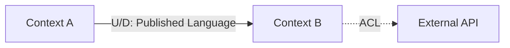

# DDD Patterns Reference

Справочник по Domain-Driven Design для idea2prd skills.

## Strategic DDD

### Bounded Context

**Определение:** Логическая граница, внутри которой domain model консистентна.

**Как идентифицировать:**
- Разные команды → разные contexts
- Разный Ubiquitous Language → разные contexts
- Разная скорость изменений → разные contexts
- Разный data ownership → разные contexts

**Template:**
```markdown
### [Context Name]
**Responsibility:** [What this context owns]
**Type:** Core | Supporting | Generic
**Key Concepts:** [Aggregates, main entities]
**Team:** [Ownership]
```

---

### Context Map Patterns

| Pattern | Description | When to Use |
|---------|-------------|-------------|
| **Partnership** | Совместная эволюция | Одна команда, тесная связь |
| **Shared Kernel** | Общая часть модели | Очень тесная связь |
| **Customer-Supplier** | U поставляет, D потребляет | Ясная зависимость |
| **Conformist** | D принимает модель U как есть | Нет влияния на U |
| **Anticorruption Layer** | D защищается от U | Legacy, внешние API |
| **Open Host Service** | U публикует API для всех | Public API |
| **Published Language** | Стандартный формат обмена | Интеграции |

**Mermaid Template:**


---

### Subdomain Classification

| Type | Characteristics | Strategy |
|------|-----------------|----------|
| **Core** | Конкурентное преимущество | Build in-house, best devs |
| **Supporting** | Нужно для Core, не уникально | Build or buy |
| **Generic** | Commodity | Buy/SaaS |

---

## Tactical DDD

### Aggregate

**Определение:** Кластер объектов с единой границей консистентности.

**Rules:**
- Транзакция = один aggregate
- Внешние ссылки только по ID
- Aggregate Root обеспечивает инварианты

**Template:**
```typescript
class Order {  // Aggregate Root
  private id: OrderId;
  private items: OrderItem[];  // Entity внутри
  private status: OrderStatus; // Value Object
  
  addItem(product: ProductId, qty: Quantity): void {
    if (this.status !== OrderStatus.DRAFT) {
      throw new Error("Cannot modify");
    }
    // ...
  }
}
```

**Size:** Max 5-7 entities per aggregate.

---

### Entity

**Определение:** Объект с уникальной идентичностью.

**Characteristics:**
- Has ID
- Mutable
- Equality by ID

```typescript
class User {
  readonly id: UserId;
  private email: Email;
  
  equals(other: User): boolean {
    return this.id.equals(other.id);
  }
}
```

---

### Value Object

**Определение:** Объект без идентичности, определяется атрибутами.

**Characteristics:**
- Immutable
- Equality by attributes
- Self-validating

**Common Value Objects:**
```typescript
// Money
class Money {
  constructor(readonly amount: number, readonly currency: Currency) {
    if (amount < 0) throw new Error("Negative");
  }
  add(other: Money): Money { /* returns new */ }
}

// Email
class Email {
  constructor(readonly value: string) {
    if (!isValid(value)) throw new Error("Invalid");
  }
}

// DateRange
class DateRange {
  constructor(readonly start: Date, readonly end: Date) {
    if (end < start) throw new Error("Invalid range");
  }
}
```

---

### Domain Event

**Определение:** Сигнал о значимом событии в домене.

**Naming:** Past tense (OrderPlaced, UserRegistered)

**Template:**
```typescript
interface DomainEvent {
  occurredAt: Date;
  aggregateId: string;
  aggregateType: string;
}

class OrderPlaced implements DomainEvent {
  constructor(
    readonly orderId: OrderId,
    readonly customerId: CustomerId,
    readonly items: OrderItemDto[],
    readonly totalAmount: Money,
    readonly occurredAt: Date = new Date()
  ) {}
}
```

---

### Repository

**Определение:** Абстракция для persistence агрегатов.

**Rules:**
- One per Aggregate Root
- Returns Aggregate, not raw data

**Template:**
```typescript
interface OrderRepository {
  findById(id: OrderId): Promise<Order | null>;
  findByCustomer(id: CustomerId): Promise<Order[]>;
  save(order: Order): Promise<void>;
  delete(id: OrderId): Promise<void>;
}
```

---

### Domain Service

**Определение:** Логика, не принадлежащая конкретному Aggregate.

**When to use:**
- Операция с несколькими Aggregates
- Stateless operations

```typescript
class PricingService {
  calculateDiscount(customer: Customer, order: Order): Money {
    // Cross-aggregate logic
  }
}
```

---

### Application Service

**Определение:** Orchestration layer (use cases).

**Responsibilities:**
- Use case coordination
- Transaction management
- Authorization
- DTO transformation

```typescript
class OrderService {
  async placeOrder(cmd: PlaceOrderCmd): Promise<OrderId> {
    const customer = await this.customerRepo.findById(cmd.customerId);
    const order = Order.create(customer, cmd.items);
    await this.orderRepo.save(order);
    await this.eventBus.publish(order.domainEvents);
    return order.id;
  }
}
```

---

## Quick Reference

### Aggregate Design Checklist

- [ ] Clear invariants identified
- [ ] Single Aggregate Root
- [ ] ≤7 entities
- [ ] External refs by ID only
- [ ] One aggregate per transaction

### Bounded Context Checklist

- [ ] Clear responsibility defined
- [ ] Ubiquitous Language documented
- [ ] Type classified (Core/Supporting/Generic)
- [ ] Relationships mapped
- [ ] Team ownership assigned

### Event Design Checklist

- [ ] Past tense naming
- [ ] Includes aggregate ID
- [ ] Immutable payload
- [ ] Contains all needed data
- [ ] Timestamp included
