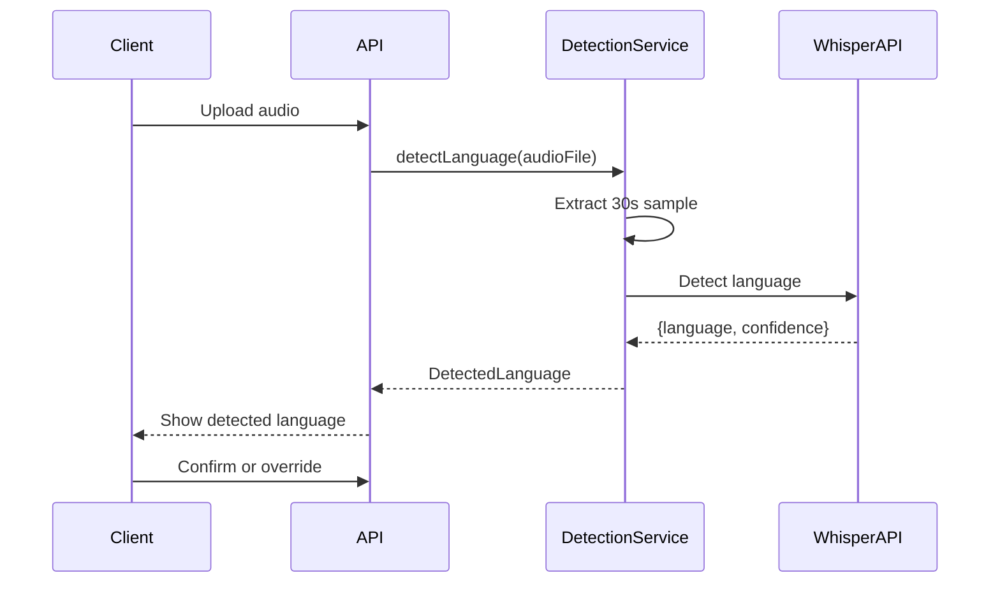

# ADR-002: Language Detection Approach

## Status
Accepted

## Context
Transcription accuracy depends on correct language identification. Users may upload audio in various languages, and manual selection is error-prone. The system needs automatic language detection before transcription.

**Related Requirements:**
- FR-002: Language Auto-detection
- NFR-001: Detection Latency (<5 seconds)

## Decision Drivers
- Accuracy: >=95% detection accuracy for 30+ second audio
- Speed: Detection must complete within 5 seconds
- Cost: Minimize API calls to Cloud.ru Whisper
- User Experience: Show confidence, allow override

## Considered Options

### Option 1: Client-Side Detection (Browser API)
**Pros:**
- No server cost
- Fast response

**Cons:**
- Limited language support
- Inconsistent across browsers
- Privacy concerns (audio processed locally)

### Option 2: Dedicated Language Detection Service
**Pros:**
- Specialized for detection
- Could support more languages

**Cons:**
- Additional service to maintain
- Extra cost
- Integration complexity

### Option 3: Cloud.ru Whisper API with Sample Analysis
**Pros:**
- Uses existing API integration
- No additional services
- Consistent with transcription

**Cons:**
- Limited to Whisper's supported languages
- Requires audio sample upload

## Decision
**Cloud.ru Whisper API with Sample Analysis** because it leverages existing infrastructure and provides sufficient accuracy.

## Architecture



## Implementation

### Detection Flow
1. Extract first 30 seconds of audio (or full file if shorter)
2. Send to Cloud.ru Whisper with `detect_language=True`
3. Parse response: language code + confidence score
4. Apply confidence threshold logic

### Confidence Thresholds
```python
CONFIDENCE_THRESHOLDS = {
    'AUTO_CONFIRM': 0.95,      # No warning, proceed
    'WARNING': 0.70,           # Show warning, allow proceed
    'MANUAL_SELECT': 0.70      # Require manual selection
}

def handle_detection_result(result: DetectionResult) -> LanguageAction:
    if result.confidence >= 0.95:
        return LanguageAction.CONFIRM
    elif result.confidence >= 0.70:
        return LanguageAction.CONFIRM_WITH_WARNING
    else:
        return LanguageAction.REQUIRE_MANUAL
```

### Fallback Strategy
```python
class LanguageDetectionService:
    async def detect_with_fallback(
        self,
        audio_file: AudioFile,
        user_preferred_language: Optional[str] = None
    ) -> DetectedLanguage:
        try:
            result = await self._detect(audio_file)
            if result.confidence >= 0.70:
                return result
        except DetectionError:
            pass

        # Fallback to user preference or English
        fallback_language = user_preferred_language or 'en'
        return DetectedLanguage(
            code=fallback_language,
            confidence=0.0,
            is_fallback=True
        )
```

## Performance Optimization

### Caching
- Cache detection results by audio file hash
- TTL: 7 days

### Parallel Detection
```python
async def detect_batch(files: List[AudioFile]) -> List[DetectedLanguage]:
    tasks = [self.detect_with_fallback(f) for f in files]
    return await asyncio.gather(*tasks)
```

### Sample Size Strategy
```python
def get_detection_sample(audio_file: AudioFile) -> AudioFile:
    # Extract first 30 seconds for detection
    # Longer files get better accuracy
    # Shorter files use full duration
    duration = audio_file.duration
    sample_duration = min(duration, 30.0)
    return audio_file.extract_sample(0, sample_duration)
```

## Consequences

### Positive
- Consistent with existing Cloud.ru integration
- No additional services required
- Sufficient accuracy for most use cases
- Fallback mechanism prevents failures

### Negative
- Limited to languages supported by Whisper
- Requires audio upload even for detection only
- Detection accuracy degrades for very short clips (<10 seconds)

### Risks
- **Risk:** Whisper API changes detection interface
- **Mitigation:** Use adapter pattern to isolate API-specific code

- **Risk:** Detection accuracy varies by language
- **Mitigation:** Document per-language accuracy, show confidence to user

## Supported Languages

| Language | Code | Expected Accuracy | Notes |
|----------|------|-------------------|-------|
| English | en | 98% | Best supported |
| Russian | ru | 95% | Good support |
| Spanish | es | 95% | Good support |
| French | fr | 93% | Moderate support |
| German | de | 93% | Moderate support |
| Portuguese | pt | 92% | Moderate support |
| Italian | it | 92% | Moderate support |
| Dutch | nl | 90% | Basic support |
| Polish | pl | 90% | Basic support |
| Chinese | zh | 88% | Basic support |

## Testing Strategy
- Unit tests for confidence threshold logic
- Integration tests with Cloud.ru Whisper
- Test with various audio lengths (5s, 30s, 1hr)
- Test with multi-language audio (verify dominant detected)

## Related ADRs
- ADR-005: Batch Processing (parallel detection)
- ADR-009: Event-Driven Communication (LanguageDetected event)
