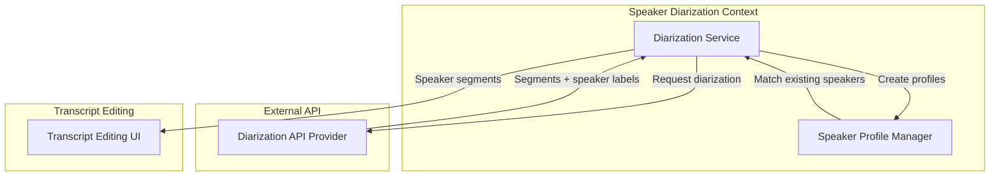

# ADR-003: Speaker Diarization Approach

## Status
Accepted

## Context
Users need to identify different speakers in audio recordings for:
- Meeting transcripts (who said what)
- Podcast production (show notes with quotes)
- Interview analysis (questioner vs respondent)

**Related Requirements:**
- FR-007: Speaker Diarization

## Decision Drivers
- Accuracy: >=85% speaker identification accuracy
- Performance: <1.5x real-time processing
- Scalability: Support 2-10 speakers
- Cost: Minimize compute expenses

## Considered Options

### Option 1: Build Custom Diarization Service
**Pros:**
- Full control over algorithm
- Can optimize for specific use cases

**Cons:**
- Requires ML expertise
- High development cost
- Ongoing maintenance burden
- Need training data and infrastructure

### Option 2: Open Source Library (e.g., Pyannote.audio)
**Pros:**
- No per-request cost
- Can self-host

**Cons:**
- Requires GPU infrastructure
- Model hosting and maintenance
- Variable accuracy across audio types
- Slower inference than commercial APIs

### Option 3: Commercial API (e.g., AssemblyAI, Deepgram)
**Pros:**
- Best accuracy
- Fast processing
- No infrastructure overhead
- Regular updates

**Cons:**
- Per-minute cost
- Vendor lock-in
- Data privacy concerns

### Option 4: Defer to Future Release
**Pros:**
- Focus on MVP features
- Assess user demand first
- Allocate resources elsewhere

**Cons:**
- Missing key user request
- Competitive disadvantage

## Decision
**Defer to v1.1, then evaluate commercial APIs** because speaker diarization requires specialized ML infrastructure and significant compute resources, which are better justified after validating user demand through MVP.

## Deferred Implementation Plan (v1.1)

### Evaluation Criteria
When implementing in v1.1, evaluate commercial APIs based on:

| Provider | Accuracy | Latency | Cost/min | Language Support |
|----------|----------|---------|----------|------------------|
| AssemblyAI | High | Fast | $$ | Multi |
| Deepgram | High | Fast | $ | Multi |
| Rev.ai | Very High | Medium | $$$ | English only |
| Speechmatics | Very High | Fast | $$$ | 50+ languages |

### Recommended Architecture (v1.1)



### Implementation Flow
1. User uploads audio with diarization enabled
2. After transcription, send audio to diarization API
3. API returns segments with speaker labels (SPEAKER_00, SPEAKER_01, etc.)
4. Create/merge speaker profiles based on voice characteristics
5. Display speaker labels in transcript editor
6. Allow users to rename speakers

## MVP Alternatives

### Manual Speaker Labeling (v1.0)
While waiting for v1.1, provide basic manual tools:
- Users can manually tag segments with speaker labels
- Simple speaker management (Add Speaker, Assign to Segment)
- Persists manual labels for export

```python
class ManualSpeakerService:
    def assign_speaker_to_segment(
        self,
        segment_id: SegmentId,
        speaker_name: str
    ) -> None:
        """Manually assign speaker to a segment"""
        segment = self.segment_repo.find(segment_id)
        segment.speaker_id = speaker_name
        self.segment_repo.save(segment)

    def create_speaker(self, transcript_id: TranscriptId, name: str) -> str:
        """Create a new speaker for this transcript"""
        return SpeakerProfile.create(
            name=name,
            is_custom=True,
            user_id=current_user_id()
        )
```

## Consequences

### Positive
- MVP focuses on core features (export, search, editing)
- Lower initial development cost
- Time to validate user demand for diarization
- Can evaluate multiple providers before commit

### Negative
- Missing feature for early adopters
- Potential competitive disadvantage
- Need to manage user expectations

### Risks
- **Risk:** Users expect diarization in MVP
- **Mitigation:** Communicate roadmap, provide manual labeling alternative

- **Risk:** Chosen v1.1 provider changes pricing
- **Mitigation:** Design adapter pattern to switch providers

## Speaker Profile Strategy

When implementing in v1.1:
1. **Session-based profiles:** Each transcript gets isolated speakers (SPEAKER_01, SPEAKER_02)
2. **Cross-session matching:** Use voice embeddings to identify same speaker across recordings
3. **User-assigned names:** Allow users to name speakers (e.g., "John", "Interviewer")
4. **Profile persistence:** Store embeddings for future matching

```python
class SpeakerProfile:
    id: SpeakerProfileId
    name: str  # SPEAKER_01 or custom name
    is_custom_name: bool
    embedding: Optional[Vector]  # Voice characteristics
    appearance_count: int
    first_seen_at: datetime
    last_seen_at: datetime

    def match_with_existing(
        self,
        new_embedding: Vector,
        threshold: float = 0.85
    ) -> bool:
        """Check if this matches existing profile"""
        if self.embedding is None:
            return False
        return cosine_similarity(self.embedding, new_embedding) >= threshold
```

## Performance Targets (v1.1)
- Processing time: <1.5x real-time (30-min audio in <45 minutes)
- Accuracy: >=85% for clear audio, 2-4 speakers
- Scalability: Support 2-10 speakers per recording

## Testing Strategy (v1.1)
- Test with various speaker counts (1, 2, 4, 8)
- Test with different audio quality (studio, phone, meeting room)
- Test with overlapping speech
- Test cross-session speaker matching

## Related ADRs
- ADR-001: Export Architecture (export with speaker labels)
- ADR-006: Transcript Editing Storage (speaker metadata)
- ADR-009: Event-Driven Communication (SpeakerSegmentsAvailable event)
