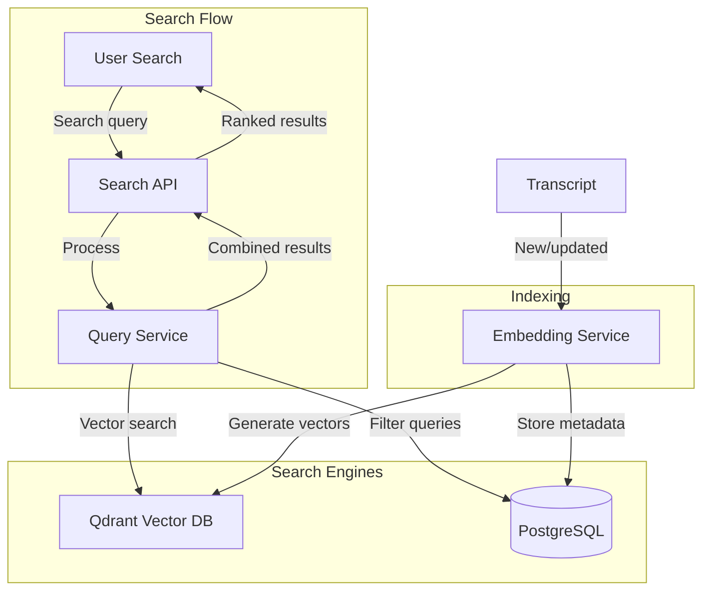

# ADR-004: Global Search Architecture

## Status
Accepted

## Context
Users need to search across all their transcripts to find specific content:
- Research: Find all mentions of a topic across 20+ interviews
- Business: Locate specific discussion in meeting archives
- Legal: Search for keywords in deposition transcripts

**Related Requirements:**
- FR-003: Global Search Across All Transcripts
- NFR-004: Search Performance (<500ms for 100K transcripts)

## Decision Drivers
- Performance: <500ms response time for 100K transcript database
- Accuracy: Relevant results ranked by semantic similarity
- Scalability: Support growth to 1M+ transcripts
- Rich Filtering: Date range, language, duration, speakers

## Considered Options

### Option 1: PostgreSQL Full-Text Search Only
**Pros:**
- No additional infrastructure
- ACID guarantees
- Familiar to team

**Cons:**
- Limited semantic understanding
- Performance degrades after 100K documents
- Basic ranking (TF-IDF only)

### Option 2: Elasticsearch
**Pros:**
- Powerful full-text search
- Excellent ranking
- Rich filtering

**Cons:**
- Heavy infrastructure (JVM-based)
- Operational complexity
- Higher hosting costs
- Overkill for current scale

### Option 3: Qdrant Vector Database + PostgreSQL
**Pros:**
- Semantic search via embeddings
- Fast vector similarity search
- Lightweight infrastructure
- Already using Qdrant for RAG

**Cons:**
- Two data stores to manage
- Vector generation cost

### Option 4: OpenSearch
**Pros:**
- Elasticsearch fork with more features
- Vector search plugin

**Cons:**
- Similar complexity to Elasticsearch
- Less mature vector search than Qdrant

## Decision
**Qdrant Vector Database + PostgreSQL** because it provides semantic search capabilities while leveraging existing Qdrant infrastructure and maintaining lightweight operations.

## Architecture



## Implementation

### Vector Generation
```python
class TranscriptEmbeddingService:
    def __init__(self, embedding_model: str = "all-MiniLM-L6-v2"):
        self.model = SentenceTransformer(embedding_model)

    def generate_transcript_embedding(
        self,
        transcript: Transcript
    ) -> np.ndarray:
        """Generate embedding for full transcript"""
        # Combine segments into searchable text
        text = " ".join([seg.text for seg in transcript.segments])
        return self.model.encode(text)

    def generate_segment_embeddings(
        self,
        segments: List[Segment]
    ) -> Dict[str, np.ndarray]:
        """Generate embeddings for each segment"""
        texts = [seg.text for seg in segments]
        embeddings = self.model.encode(texts)
        return {
            seg.id: emb
            for seg, emb in zip(segments, embeddings)
        }
```

### Search Query Processing
```python
class SearchService:
    async def search(
        self,
        query: SearchQuery
    ) -> SearchResult:
        # 1. Generate query embedding
        query_embedding = self.embedding_service.encode(query.search_term)

        # 2. Vector search in Qdrant
        vector_results = await self.qdrant_client.search(
            collection_name="transcripts",
            query_vector=query_embedding,
            limit=query.limit * 2,  # Fetch more for re-ranking
            score_threshold=0.3  # Minimum similarity
        )

        # 3. Apply filters in PostgreSQL
        transcript_ids = [r.id for r in vector_results]
        filtered_ids = await self.postgres_repo.apply_filters(
            transcript_ids,
            query.filters
        )

        # 4. Combine and re-rank
        results = self._combine_and_rank(
            vector_results,
            filtered_ids,
            query
        )

        return results
```

### Qdrant Collection Schema
```python
collection_config = {
    "name": "transcripts",
    "vectors": {
        "size": 384,  # all-MiniLM-L6-v2 dimension
        "distance": "Cosine"
    },
    "payload_schema": {
        "transcript_id": "str",
        "user_id": "str",
        "language": "str",
        "duration": "float",
        "created_at": "str",
        "speaker_count": "int",
        "word_count": "int"
    }
}
```

### PostgreSQL for Metadata
```sql
-- Index for filter queries
CREATE INDEX idx_transcripts_user_language
ON transcripts(user_id, language);

CREATE INDEX idx_transcripts_date_range
ON transcripts(created_at DESC);

-- Index for speaker filtering
CREATE INDEX idx_segments_speaker
ON transcript_segments(speaker_id)
WHERE speaker_id IS NOT NULL;
```

## Relevance Ranking

### Multi-Factor Scoring
```python
def calculate_relevance_score(
    vector_score: float,     # Semantic similarity (0-1)
    term_frequency: int,      # How many times query appears
    position_bonus: float,    # Earlier matches score higher
    recency_bonus: float      # Recent transcripts score higher
) -> float:
    weights = {
        'semantic': 0.6,
        'frequency': 0.2,
        'position': 0.1,
        'recency': 0.1
    }

    return (
        vector_score * weights['semantic'] +
        min(term_frequency / 10, 1.0) * weights['frequency'] +
        position_bonus * weights['position'] +
        recency_bonus * weights['recency']
    )
```

## Indexing Strategy

### Two-Level Indexing
1. **Transcript-level:** Embedding of full transcript for overall relevance
2. **Segment-level:** Embeddings per segment for precise matching

### Indexing Pipeline
```python
async def index_transcript(transcript: Transcript):
    # Generate embeddings
    transcript_emb = embedding_service.generate_transcript_embedding(transcript)
    segment_embs = embedding_service.generate_segment_embeddings(transcript.segments)

    # Upsert to Qdrant
    await qdrant_client.upsert(
        collection_name="transcripts",
        points=[
            PointStruct(
                id=str(transcript.id),
                vector=transcript_emb.tolist(),
                payload={
                    "transcript_id": str(transcript.id),
                    "type": "transcript",
                    **transcript.metadata
                }
            ),
            *[
                PointStruct(
                    id=f"{transcript.id}_{seg_id}",
                    vector=emb.tolist(),
                    payload={
                        "transcript_id": str(transcript.id),
                        "segment_id": seg_id,
                        "type": "segment"
                    }
                )
                for seg_id, emb in segment_embs.items()
            ]
        ]
    )
```

## Performance Optimization

### Caching
```python
# Cache popular queries
@lru_cache(maxsize=1000)
async def search_cached(query_hash: str) -> SearchResult:
    return await search_service.search(query)
```

### Pagination
```python
class PaginatedSearchResult:
    results: List[SearchResultItem]
    total_count: int
    page: int
    page_size: int
    has_next: bool
    has_prev: bool
```

## Consequences

### Positive
- Semantic search finds conceptually similar content
- Fast vector similarity search (<100ms)
- Leverages existing Qdrant infrastructure
- Scales well to millions of transcripts

### Negative
- Additional indexing latency (embedding generation)
- Two data stores to synchronize
- Vector storage cost

### Risks
- **Risk:** Embedding model changes break existing vectors
- **Mitigation:** Version embeddings, support migration

- **Risk:** Qdrant single point of failure
- **Mitigation:** Replication, backups, fallback to PostgreSQL search

## Performance Benchmarks
- Indexing: 1 second per 10K words
- Search: <500ms for 100K transcripts
- Storage: ~1.5KB per transcript (384-dim vector)

## Future Enhancements
- Hybrid search: Combine vector + keyword search
- Query expansion: Add synonyms to improve recall
- Personalization: Rank based on user behavior
- Faceted search: Auto-generated filter options

## Related ADRs
- ADR-009: Event-Driven Communication (transcript indexed events)
- ADR-011: Scalability Strategy (Qdrant sharding)
