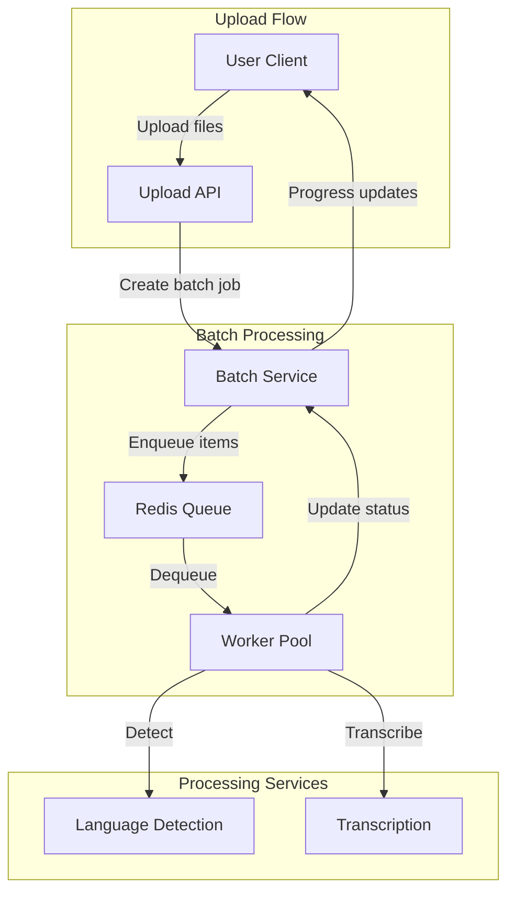

# ADR-005: Batch Processing Strategy

## Status
Accepted

## Context
Users need to upload multiple audio files for transcription:
- Media companies processing daily content
- Researchers analyzing multiple interviews
- Businesses handling meeting archives

**Related Requirements:**
- FR-005: Batch File Upload
- NFR-005: Concurrent User Support (100 concurrent users)

## Decision Drivers
- Throughput: Process 10 files efficiently without blocking
- User Experience: Show progress for each file
- Reliability: Individual file failures don't stop batch
- Resource Management: Limit concurrent processing

## Considered Options

### Option 1: Parallel Fire-and-Forget
**Pros:**
- Simplest implementation
- Fastest processing

**Cons:**
- No resource control (can overwhelm system)
- Difficult to track progress
- No error handling per file

### Option 2: Sequential Processing
**Pros:**
- Simple to implement
- Predictable resource usage

**Cons:**
- Slow (10 files processed one by one)
- Poor user experience
- No fault isolation

### Option 3: Queue-Based with Controlled Concurrency
**Pros:**
- Controlled resource usage
- Progress tracking
- Fault isolation
- Can scale horizontally

**Cons:**
- Additional infrastructure (queue)
- More complex implementation

### Option 4: Client-Side Batch Orchestration
**Pros:**
- No server-side complexity
- Client controls pacing

**Cons:**
- Slower (network latency per file)
- No server-side tracking
- Inconsistent results

## Decision
**Queue-Based with Controlled Concurrency using Redis** because it provides the best balance of throughput, reliability, and user experience while being lightweight to operate.

## Architecture



## Implementation

### Queue Configuration
```python
import redis
from rq import Queue

# Redis connection
redis_conn = redis.Redis(host='localhost', port=6379, db=0)

# Priority queues
high_priority_queue = Queue('high', connection=redis_conn)
default_queue = Queue('default', connection=redis_conn)
low_priority_queue = Queue('low', connection=redis_conn)

# Worker configuration
MAX_CONCURRENT_JOBS = 3
JOB_TIMEOUT = 3600  # 1 hour
```

### Batch Job Model
```python
class BatchJob(Aggregate):
    id: BatchJobId
    user_id: UserId
    items: List[BatchItem]
    status: BatchJobStatus  # pending, processing, completed, failed

    def enqueue(self, queue: Queue) -> None:
        """Enqueue all items for processing"""
        self.status = BatchJobStatus.PROCESSING

        for item in self.items:
            job = queue.enqueue(
                'process_batch_item',
                args=(item.id, self.user_id),
                job_timeout=JOB_TIMEOUT,
                result_ttl=3600
            )
            item.job_id = job.id

        self.batch_repo.save(self)

    def update_progress(self) -> BatchProgress:
        """Calculate batch progress"""
        completed = sum(1 for i in self.items if i.is_complete)
        progress = (completed / len(self.items)) * 100

        return BatchProgress(
            total=len(self.items),
            completed=completed,
            failed=sum(1 for i in self.items if i.is_failed),
            progress_percent=progress
        )
```

### Batch Item Processing
```python
def process_batch_item(item_id: BatchItemId, user_id: UserId) -> ProcessResult:
    """Worker job function"""
    item = batch_item_repo.find(item_id)

    try:
        item.status = ItemStatus.PROCESSING
        batch_item_repo.save(item)

        # Language detection
        language = detection_service.detect(item.audio_file)
        item.detected_language = language

        # Transcription
        transcript = transcription_service.transcribe(
            item.audio_file,
            language=language
        )
        item.transcript_id = transcript.id

        item.status = ItemStatus.COMPLETED
        item.completed_at = datetime.now()

    except Exception as e:
        item.status = ItemStatus.FAILED
        item.error_message = str(e)
        logger.error(f"Batch item {item_id} failed: {e}")

    finally:
        batch_item_repo.save(item)

        # Notify batch job to update progress
        batch_job = item.batch_job
        if batch_job.all_items_complete:
            batch_job.status = BatchJobStatus.COMPLETED

        batch_job_repo.save(batch_job)

    return ProcessResult(item_id, item.status, item.transcript_id)
```

### Concurrency Control
```python
class ConcurrencyManager:
    def __init__(self, max_concurrent: int = 3):
        self.max_concurrent = max_concurrent
        self.semaphore = asyncio.Semaphore(max_concurrent)

    async def process_with_limit(
        self,
        items: List[BatchItem]
    ) -> List[ProcessResult]:
        """Process items with concurrency limit"""
        async def process_one(item):
            async with self.semaphore:
                return await self.process_item(item)

        tasks = [process_one(item) for item in items]
        return await asyncio.gather(*tasks)
```

## Progress Tracking

### Real-Time Updates
```python
# WebSocket endpoint for real-time progress
@websocket.websocket("/ws/batch/{batch_job_id}")
async def batch_progress_ws(websocket: WebSocket, batch_job_id: str):
    await websocket.accept()

    try:
        while True:
            batch_job = batch_job_repo.find(batch_job_id)
            progress = batch_job.update_progress()

            await websocket.send_json({
                "status": batch_job.status.value,
                "progress": progress.progress_percent,
                "completed": progress.completed,
                "total": progress.total,
                "items": [
                    {
                        "filename": item.filename,
                        "status": item.status.value,
                        "error": item.error_message
                    }
                    for item in batch_job.items
                ]
            })

            if batch_job.is_complete:
                break

            await asyncio.sleep(1)

    finally:
        await websocket.close()
```

## Error Handling

### Fault Isolation
```python
class BatchItem(Aggregate):
    # ... other fields ...

    def fail(self, error: Exception) -> None:
        """Mark item as failed but don't affect batch"""
        self.status = ItemStatus.FAILED
        self.error_message = str(error)
        self.failed_at = datetime.now()

        # Batch can still succeed if other items complete
        self.batch_job.check_completion()
```

### Retry Strategy
```python
RETRY_LIMITS = {
    ItemStatus.FAILED: 0,        # Don't retry failures
    ItemStatus.TIMEOUT: 1,       # Retry once on timeout
    ItemStatus.QUEUED: 3         # Retry up to 3 times
}

def should_retry(item: BatchItem) -> bool:
    """Determine if item should be retried"""
    return item.retry_count < RETRY_LIMITS.get(item.status, 0)
```

## Performance Considerations

### Queue Priorities
```python
def enqueue_with_priority(item: BatchItem, user_tier: str) -> None:
    """Enqueue based on user tier"""
    queue = {
        'enterprise': high_priority_queue,
        'premium': default_queue,
        'free': low_priority_queue
    }.get(user_tier, default_queue)

    queue.enqueue(process_batch_item, args=(item.id,))
```

### Worker Scaling
```python
# Dynamic worker pool based on queue size
def scale_workers(queue: Queue) -> None:
    queue_size = len(queue)
    target_workers = min(
        MAX_CONCURRENT_JOBS,
        max(1, queue_size // 10)  # 1 worker per 10 items
    )

    current_workers = get_active_worker_count()
    if target_workers > current_workers:
        spawn_workers(target_workers - current_workers)
```

## Monitoring

### Metrics
```python
class BatchMetrics:
    def __init__(self):
        self.total_batches = Counter('batches_total')
        self.batch_duration = Histogram('batch_duration_seconds')
        self.item_duration = Histogram('item_duration_seconds')
        self.failure_rate = Gauge('batch_failure_rate')

    def record_batch_completion(self, batch: BatchJob):
        self.total_batches.inc()
        self.batch_duration.observe(batch.duration)
        self.failure_rate.set(batch.failure_rate)
```

## Consequences

### Positive
- Controlled resource usage prevents overload
- Clear progress tracking for good UX
- Fault isolation prevents cascading failures
- Can scale horizontally (multiple workers)

### Negative
- Additional Redis dependency
- More complex than simple parallel processing
- Requires worker process management

### Risks
- **Risk:** Redis failure blocks all batch processing
- **Mitigation:** Redis persistence + fallback to direct processing

- **Risk:** Worker starvation on large batches
- **Mitigation:** Fair queue scheduling, timeout enforcement

## Performance Targets
- Concurrency: Max 3 simultaneous transcriptions per user
- Throughput: 10 files in ~1/3 sequential time (with 3 workers)
- Progress updates: <1 second latency
- Queue processing: <5 seconds from enqueue to start

## Testing Strategy
- Test with max batch size (10 files)
- Test individual item failures
- Test worker pool scaling
- Test queue priorities
- Test concurrent batches from multiple users

## Related ADRs
- ADR-002: Language Detection (parallel detection in batch)
- ADR-009: Event-Driven Communication (BatchItemCompleted events)
- ADR-011: Scalability Strategy (horizontal scaling)
