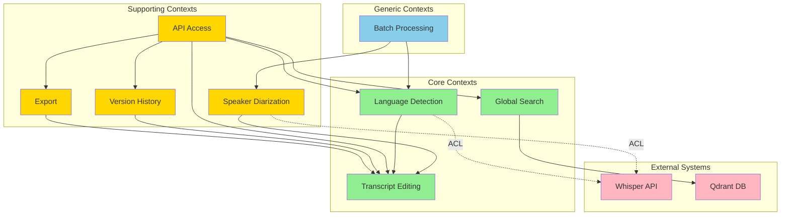

# Bounded Contexts - Feature 3: New Features

**Version:** 1.0.0
**Date:** 2026-02-03

## Overview

This document defines the bounded contexts for Feature 3, establishing clear boundaries within which the domain model is consistent and ubiquitous language is shared.

## Bounded Context Definitions

### 1. Export Context

**Responsibility:** Transform transcripts into various export formats for external consumption.

**Type:** Supporting

**Key Concepts:**
- ExportFormat (Value Object): SRT, VTT, DOCX, TXT, JSON
- ExportJob (Aggregate): Orchestrates export process
- ExportTemplate (Entity): Custom formatting rules
- Timecode (Value Object): Timestamp representation (SRT: HH:MM:SS,mmm, VTT: HH:MM:SS.mmm)

**Ubiquitous Language:**
| Term | Definition |
|------|------------|
| **Export** | Process of converting transcript to external format |
| **Timecode** | Timestamp indicating segment start/end |
| **Subtitle Format** | Format with timecodes and text (SRT, VTT) |
| **Document Format** | Format without timecodes (TXT, DOCX) |
| **Structured Format** | Format with metadata (JSON) |

**Team:** Backend Development

---

### 2. Language Detection Context

**Responsibility:** Automatically identify the spoken language in audio files before transcription.

**Type:** Core

**Key Concepts:**
- DetectedLanguage (Value Object): Language code + confidence score
- LanguageDetector (Domain Service): Orchestrates detection logic
- AudioSample (Entity): Segment of audio for analysis
- DetectionThreshold (Value Object): Minimum confidence for auto-confirm

**Ubiquitous Language:**
| Term | Definition |
|------|------------|
| **Auto-detection** | Automatic language identification from audio |
| **Confidence Score** | Probability (0-1) of detection accuracy |
| **Detection Threshold** | Minimum confidence to auto-confirm |
| **Fallback Language** | Default language when detection fails |
| **Multi-language** | Audio with multiple languages |

**Team:** ML Engineering + Backend Development

---

### 3. Speaker Diarization Context

**Responsibility:** Identify, segment, and label different speakers in audio recordings.

**Type:** Supporting

**Key Concepts:**
- Speaker (Entity): Identified person with profile
- SpeakerSegment (Value Object): Time range + speaker reference
- SpeakerProfile (Entity): Accumulated speaker characteristics
- DiarizationResult (Aggregate): Complete speaker segmentation

**Ubiquitous Language:**
| Term | Definition |
|------|------------|
| **Diarization** | Process of identifying who spoke when |
| **Speaker Count** | Number of distinct speakers detected |
| **Speaker Label** | Identifier for speaker (SPEAKER_01, custom name) |
| **Speaker Profile** | Learned characteristics for speaker identification |
| **Segment** | Continuous audio by one speaker |

**Team:** ML Engineering

---

### 4. Global Search Context

**Responsibility:** Enable full-text search across all user transcripts with intelligent ranking.

**Type:** Core

**Key Concepts:**
- SearchQuery (Aggregate): User search with filters
- SearchResult (Entity): Ranked match with context snippet
- SearchFilter (Value Object): Date range, language, tags, speakers
- RelevanceScore (Value Object): Ranking metric (0-1)

**Ubiquitous Language:**
| Term | Definition |
|------|------------|
| **Full-text Search** | Search across transcript content |
| **Context Snippet** | Text surrounding match (highlighted) |
| **Relevance Ranking** | Order results by match quality |
| **Filter** | Constraint on search (date, language, etc.) |
| **Query** | User's search input |

**Team:** Backend Development + ML Engineering

---

### 5. Batch Processing Context

**Responsibility:** Orchestrate multi-file uploads and concurrent transcription processing.

**Type:** Generic

**Key Concepts:**
- BatchJob (Aggregate): Multiple files for processing
- BatchItem (Entity): Individual file in batch
- ProcessingQueue (Domain Service): Queue management
- ConcurrencyLimit (Value Object): Max concurrent jobs

**Ubiquitous Language:**
| Term | Definition |
|------|------------|
| **Batch** | Group of files uploaded together |
| **Queue** | Waiting line for processing |
| **Concurrency Limit** | Maximum simultaneous jobs |
| **Item Status** | Pending, Processing, Completed, Failed |
| **Progress** | Percentage of batch completed |

**Team:** Backend Development

---

### 6. Transcript Editing Context

**Responsibility:** Enable users to edit transcript text with synchronized audio playback.

**Type:** Core

**Key Concepts:**
- EditableTranscript (Aggregate): Transcript with editing capabilities
- TranscriptSegment (Entity): Time-aligned text unit
- EditOperation (Value Object): Insert, delete, replace
- PlaybackPosition (Value Object): Current audio timestamp

**Ubiquitous Language:**
| Term | Definition |
|------|------------|
| **Segment** | Time-aligned text unit |
| **Sync** | Alignment between text and audio position |
| **Auto-scroll** | Automatic text scrolling during playback |
| **Edit Operation** | Type of change (insert, delete, replace) |
| **Edited Flag** | Marker indicating changed content |

**Team:** Frontend Development + Backend Development

---

### 7. Version History Context

**Responsibility:** Track all changes to transcripts with restore capability.

**Type:** Supporting

**Key Concepts:**
- TranscriptVersion (Entity): Snapshot of transcript state
- VersionDiff (Value Object): Comparison between versions
- VersionChain (Aggregate): Ordered sequence of versions
- RetentionPolicy (Value Object): Max versions per transcript

**Ubiquitous Language:**
| Term | Definition |
|------|------------|
| **Version** | Snapshot of transcript at point in time |
| **Diff** | Comparison between two versions |
| **Restore** | Revert to previous version |
| **Retention** | Maximum versions to keep |
| **Change Summary** | Description of version changes |

**Team:** Backend Development

---

### 8. API Access Context

**Responsibility:** Provide REST API for programmatic access to all system capabilities.

**Type:** Supporting

**Key Concepts:**
- ApiClient (Entity): External application with API key
- ApiKey (Value Object): Authentication token
- RateLimit (Value Object): Max requests per time window
- ApiEndpoint (Entity): Exposed system capability

**Ubiquitous Language:**
| Term | Definition |
|------|------------|
| **API Key** | Authentication token for client |
| **Rate Limit** | Maximum requests per time period |
| **Endpoint** | Exposed system operation |
| **Request** | API call from client |
| **Response** | Data returned from API |

**Team:** Backend Development + DevOps

---

## Context Map

## Context Relationships

| Context A | Context B | Relationship | Pattern | Description |
|-----------|-----------|--------------|---------|-------------|
| Transcript Editing | Export | U/D | Customer-Supplier | Editing supplies transcripts to Export |
| Transcript Editing | Version History | U/D | Partnership | Tight collaboration, same team |
| Transcript Editing | Language Detection | U/D | Customer-Supplier | Detection supplies language to Editing |
| API Access | All Contexts | U/D | Open Host Service | API exposes all capabilities |
| Speaker Diarization | Whisper API | U/D | Anticorruption Layer | Shield from external API changes |
| Global Search | Qdrant | U/D | Shared Kernel | Both use Qdrant for search |
| Batch Processing | Language Detection | U/D | Orchestrator | Batch calls Detection for each file |

## Subdomain Classification Rationale

### Core Subdomains

**Language Detection**
- **Rationale:** Unique competitive advantage, requires specialized ML expertise
- **Investment:** Build custom service with Cloud.ru API integration
- **Team:** ML Engineer + Backend Developer

**Global Search**
- **Rationale:** Critical for user retention, complex ranking algorithms
- **Investment:** Build with Qdrant vector search + custom ranking
- **Team:** Backend Developer + ML Engineer

**Transcript Editing**
- **Rationale:** High user engagement, complex audio-text synchronization
- **Investment:** Build custom editing UI with WebSocket sync
- **Team:** Frontend Developer + Backend Developer

### Supporting Subdomains

**Export**
- **Rationale:** Necessary but not unique, many libraries available
- **Investment:** Build with pypandoc/subtitle libraries
- **Team:** Backend Developer

**Speaker Diarization**
- **Rationale:** Enhanced value but can use external service
- **Investment:** Integrate third-party diarization service
- **Team:** ML Engineer (integration only)

**Version History**
- **Rationale:** User confidence feature, can be deferred
- **Investment:** Build simple versioning system
- **Team:** Backend Developer

**API Access**
- **Rationale:** Integration capability, standard REST
- **Investment:** Build with FastAPI OpenAPI
- **Team:** Backend Developer + DevOps

### Generic Subdomains

**Batch Processing**
- **Rationale:** Commodity queue management
- **Investment:** Use Redis/RabbitMQ with standard patterns
- **Team:** Backend Developer

## Context Boundaries

### Enforced Boundaries

1. **Separate Database Schemas** (where applicable)
2. **Separate API Modules** (FastAPI routers)
3. **Separate Frontend Modules** (React routes/components)
4. **Domain Events for Communication** (async messaging)
5. **Ubiquitous Language per Context** (glossary enforcement)

### Allowed Cross-Context Access

| From | To | Access Type | Limitation |
|------|-----|-------------|------------|
| Export | Transcript | Read-only | By ID only |
| Version History | Transcript | Read-only | Snapshot copy |
| Global Search | Transcript | Read-only | Search index only |
| API Access | All | Full | Via API endpoints only |

## Implementation Priorities

### Phase 1 (MVP)
1. Export Context (SRT, VTT only)
2. Language Detection Context
3. Global Search Context (basic)
4. Transcript Editing Context
5. API Access Context

### Phase 2 (v1.1)
6. Speaker Diarization Context
7. Version History Context

### Phase 3 (v1.2)
8. Batch Processing Context (enhanced)
9. Advanced Search Features

## Glossary

| Term | Context | Definition |
|------|---------|------------|
| **Transcript** | Shared | Complete text representation of audio |
| **Segment** | Editing, Export | Time-aligned text unit |
| **Speaker** | Diarization, Editing | Identified person in audio |
| **Language** | Detection, Search | Detected or specified language |
| **Export** | Export | Converted transcript file |
| **Version** | Version History | Transcript state snapshot |
| **Batch** | Batch Processing | Group of files to process |
| **API Key** | API Access | Authentication token |
