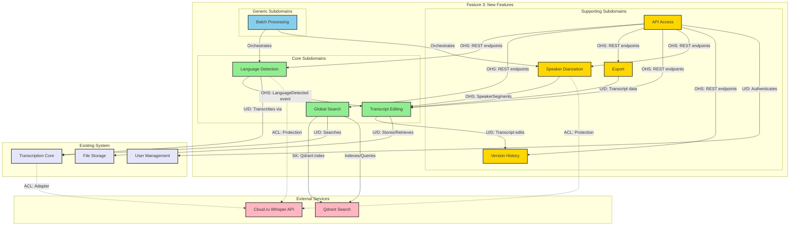

# Context Map - Feature 3: New Features

**Version:** 1.0.0
**Date:** 2026-02-03

## Overview

This document defines the relationships between bounded contexts in Feature 3, showing how they integrate and communicate.

## Integration Patterns Reference

| Pattern | Symbol | Description |
|---------|--------|-------------|
| **Partnership** | <> | Two contexts evolve together, same team |
| **Shared Kernel** | SK | Shared portion of model between contexts |
| **Customer-Supplier** | U/D | Upstream defines, Downstream consumes |
| **Conformist** | C | Downstream accepts upstream model as-is |
| **Anticorruption Layer** | ACL | Downstream protects from upstream changes |
| **Open Host Service** | OHS | Upstream publishes API for all downstream |
| **Published Language** | PL | Standardized communication format |

## System Context Map

## Relationship Details

### 1. Language Detection to Transcript Editing

**Pattern:** Open Host Service (OHS)
**Direction:** Upstream (Language Detection) to Downstream (Transcript Editing)

**Integration:**
- **Event:** `LanguageDetected`
- **Payload:** `{transcriptId, language, confidence, detectedAt}`
- **Trigger:** After language detection completes
- **Action:** Editing context displays detected language

**Anti-Corruption:**
- Editing context stores language as value object
- No dependency on detection implementation details

---

### 2. Global Search to Qdrant

**Pattern:** Shared Kernel (SK)
**Direction:** Bidirectional

**Integration:**
- **Shared:** Qdrant collection schema, vector embeddings
- **Separate:** Ranking algorithms, filter logic
- **Synchronization:** Search context updates Qdrant on transcript changes

**Governance:**
- Joint ownership of Qdrant schema
- Search context owns ranking logic

---

### 3. Transcript Editing to Version History

**Pattern:** Partnership
**Direction:** Bidirectional

**Integration:**
- **Same Team:** Frontend + Backend developers
- **Shared:** Edit session state
- **Tight Coupling:** Version created on every edit

**Coordination:**
- Daily standup covers both contexts
- Shared code ownership allowed

---

### 4. Export to Transcript Editing

**Pattern:** Customer-Supplier
**Direction:** Upstream (Transcript Editing) to Downstream (Export)

**Integration:**
- **API:** Export calls Editing for transcript data
- **Contract:** Transcript data structure (DTO)
- **SLA:** Export must handle 10K-word transcripts

**Testing:**
- Consumer-driven contract tests
- Versioned API contracts

---

### 5. API Access to All Contexts

**Pattern:** Open Host Service (OHS)
**Direction:** Upstream (All Contexts) to Downstream (API Access)

**Integration:**
- **Published API:** OpenAPI 3.0 specification
- **Versioning:** URL path versioning (/api/v1/, /api/v2/)
- **Documentation:** Swagger UI auto-generated

**Governance:**
- API team owns documentation
- Context teams own endpoints

---

### 6. Batch Processing to Language Detection

**Pattern:** Orchestrator (Custom)
**Direction:** Orchestrator (Batch) to Orchestrated (Detection)

**Integration:**
- **Pattern:** Batch enqueues detection jobs for each file
- **Queue:** Redis queue with priority
- **Concurrency:** Max 3 detections simultaneously

**Error Handling:**
- Failed detection doesn't stop batch
- Individual file status tracked

---

### 7. Speaker Diarization to Transcript Editing

**Pattern:** Open Host Service (OHS)
**Direction:** Upstream (Diarization) to Downstream (Editing)

**Integration:**
- **Event:** `SpeakerSegmentsAvailable`
- **Payload:** `{transcriptId, segments: [{startTime, endTime, speakerId}]}`
- **Display:** Editing shows speaker labels on segments

**Fallback:**
- Editing works without diarization
- Graceful degradation

---

### 8. Language Detection to Cloud.ru Whisper API

**Pattern:** Anticorruption Layer (ACL)
**Direction:** Downstream (Detection) to Upstream (Whisper API)

**Integration:**
- **Adapter:** `WhisperDetectionAdapter`
- **Mapping:** Cloud.ru response to domain model
- **Protection:** Cloud.ru changes don't affect domain

**Adapter Responsibilities:**
- Retry logic
- Rate limiting
- Response normalization
- Error translation

---

### 9. Global Search to Transcription Core

**Pattern:** Customer-Supplier
**Direction:** Upstream (Transcription Core) to Downstream (Global Search)

**Integration:**
- **Event:** `TranscriptCompleted`
- **Payload:** Full transcript with metadata
- **Action:** Search indexes transcript in Qdrant

**Timing:**
- Asynchronous indexing
- Near-real-time availability

---

## Communication Mechanisms

### Synchronous Communication

| Context A | Context B | Method | Protocol |
|-----------|-----------|--------|----------|
| Export | Editing | HTTP GET/POST | REST/JSON |
| API Access | All | HTTP GET/POST/PUT/DELETE | REST/JSON |
| Editing | Version | HTTP POST | REST/JSON |
| Batch | Detection | HTTP POST | REST/JSON |

### Asynchronous Communication

| Producer | Event | Consumer | Mechanism |
|----------|-------|----------|-----------|
| Detection | LanguageDetected | Editing | Redis Pub/Sub |
| Diarization | SpeakerSegmentsAvailable | Editing | Redis Pub/Sub |
| Transcription | TranscriptCompleted | Search | Redis Pub/Sub |
| Editing | TranscriptEdited | Search | Redis Pub/Sub |
| Editing | TranscriptEdited | Version | Direct database write |

## Data Ownership

| Data Entity | Owner Context | Access Rights |
|-------------|---------------|---------------|
| Transcript text | Transcription Core | Read-only (all others) |
| Language detection result | Language Detection | Read-only (Editing, Search) |
| Speaker segments | Speaker Diarization | Read-only (Editing) |
| Export files | Export | Owned |
| Version snapshots | Version History | Owned |
| Search index | Global Search | Owned |

## Integration Tests

### Contract Tests
- Export contract with Transcript Editing
- API contracts with all contexts
- Search contract with Qdrant

### Consumer-Driven Tests
- API context defines test scenarios
- All contexts must pass API tests

### Integration Tests
- End-to-end: Upload -> Detect -> Transcribe -> Search -> Export
- Speaker Diarization -> Editing flow
- Batch Processing -> Multiple detections

## Governance

### Cross-Context Teams

| Team | Contexts | Cadence |
|------|----------|---------|
| Frontend Team | Transcript Editing, Export (UI) | Daily standup |
| Backend Team | All contexts | Weekly planning |
| ML Team | Detection, Diarization, Search | Weekly sync |

### Architecture Decision Process

1. **Context-Level Decisions:** Context team decides
2. **Cross-Context Decisions:** Architecture group (tech leads)
3. **System-Wide Decisions:** CTO + architects

### Change Management

- **Breaking Changes:** 2-week notice to downstream
- **Deprecations:** 3-month window
- **Versioning:** Semantic versioning for APIs

## Migration Path

### Phase 1: Initial Boundaries
- All contexts in same FastAPI application
- Separate Python modules per context
- Database schemas separated by schema prefix

### Phase 2: Microservices (Future)
- Extract Core contexts to separate services
- Maintain Supporting contexts in monolith
- Event-driven communication

### Phase 3: Full Microservices (Optional)
- Each context as independent service
- Service mesh for communication
- Independent deployment
