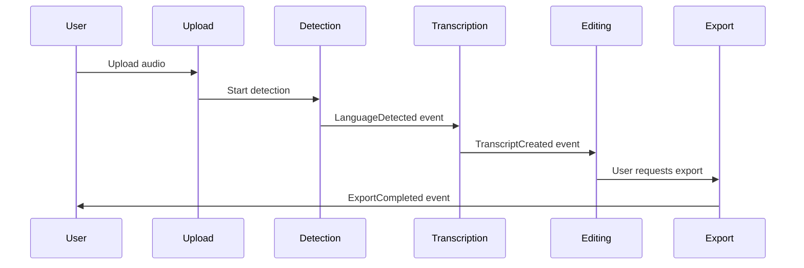
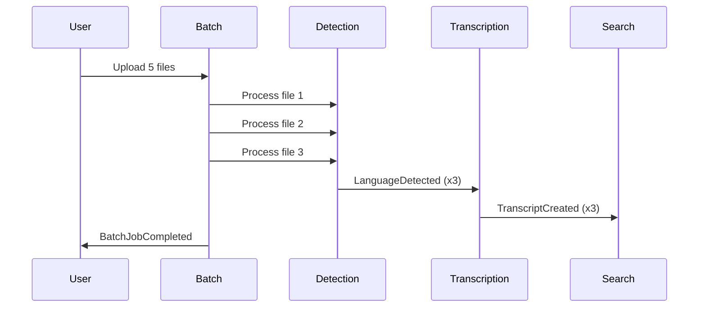
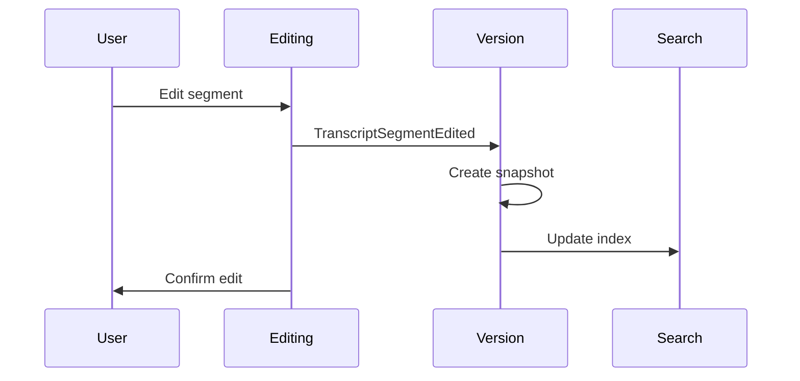

# Domain Events - Feature 3: New Features

**Version:** 1.0.0
**Date:** 2026-02-03

## Overview

This document defines the strategic domain events that flow between bounded contexts in Feature 3, enabling loose coupling and asynchronous communication.

## Event Naming Convention

All domain events follow this naming pattern:
- **Past tense:** `LanguageDetected` (not `DetectLanguage`)
- **Domain-specific:** Use ubiquitous language
- **Complete:** Name indicates what happened

## Event Schema

All events include these base fields:

```typescript
interface DomainEvent {
  eventId: string;           // Unique event ID
  eventType: string;         // Event type name
  aggregateId: string;       // ID of the aggregate that emitted
  aggregateType: string;     // Type of aggregate (Transcript, ExportJob, etc.)
  occurredAt: DateTime;      // When the event occurred
  correlationId?: string;    // For event chains
  causationId?: string;      // Event that caused this event
  data: object;              // Event-specific payload
}
```

## Language Detection Context Events

### LanguageDetected

**Emitted by:** Language Detection Context
**Consumed by:** Transcript Editing, Global Search, Batch Processing

**Trigger:** Language detection completes for an audio file

**Payload:**
```json
{
  "transcriptId": "uuid",
  "audioFileId": "uuid",
  "language": {
    "code": "en",
    "name": "English",
    "confidence": 0.95
  },
  "detectionDuration": 3.2,
  "sampleAnalyzed": 30.5
}
```

**Downstream Actions:**
- **Editing:** Update language display, enable language-specific features
- **Search:** Add language filter to search index
- **Batch:** Mark detection as complete for batch item

---

### LanguageDetectionFailed

**Emitted by:** Language Detection Context
**Consumed by:** Batch Processing, Error Handling

**Trigger:** Language detection fails (technical error)

**Payload:**
```json
{
  "audioFileId": "uuid",
  "error": {
    "code": "AUDIO_TOO_SHORT",
    "message": "Audio file is less than 5 seconds",
    "retryable": false
  },
  "fallbackLanguage": {
    "code": "en",
    "name": "English"
  }
}
```

**Downstream Actions:**
- **Batch:** Mark item as failed or use fallback language
- **Error Handling:** Log error, notify user

---

## Speaker Diarization Context Events

### SpeakerSegmentsAvailable

**Emitted by:** Speaker Diarization Context
**Consumed by:** Transcript Editing, Export

**Trigger:** Speaker diarization completes

**Payload:**
```json
{
  "transcriptId": "uuid",
  "speakerCount": 3,
  "segments": [
    {
      "segmentId": "uuid",
      "speakerId": "SPEAKER_01",
      "startTime": 0.0,
      "endTime": 15.5
    }
  ],
  "processingDuration": 68.3
}
```

**Downstream Actions:**
- **Editing:** Display speaker labels on segments, enable speaker renaming
- **Export:** Include speaker labels in exported files

---

### SpeakerProfileCreated

**Emitted by:** Speaker Diarization Context
**Consumed by:** Transcript Editing

**Trigger:** New speaker profile is learned

**Payload:**
```json
{
  "speakerProfileId": "uuid",
  "name": "SPEAKER_01",
  "characteristics": {
    "embeddings": [...],
    "avgPitch": 150.5,
    "avgSpeed": 145.2
  },
  "firstSeenIn": "transcript-uuid"
}
```

**Downstream Actions:**
- **Editing:** Enable custom naming for speaker

---

## Global Search Context Events

### TranscriptIndexed

**Emitted by:** Global Search Context
**Consumed by:** Monitoring, Analytics

**Trigger:** Transcript is successfully indexed in Qdrant

**Payload:**
```json
{
  "transcriptId": "uuid",
  "indexId": "qdrant-point-id",
  "indexedAt": "2024-01-15T10:30:00Z",
  "vectorDimension": 1536,
  "metadata": {
    "language": "en",
    "duration": 1800,
    "wordCount": 15000
  }
}
```

**Downstream Actions:**
- **Monitoring:** Track indexing performance
- **Analytics:** Update search coverage metrics

---

### SearchExecuted

**Emitted by:** Global Search Context
**Consumed by:** Analytics, Monitoring

**Trigger:** User executes a search query

**Payload:**
```json
{
  "queryId": "uuid",
  "userId": "uuid",
  "searchTerm": "user experience",
  "filters": {
    "language": "en",
    "dateRange": {
      "start": "2024-01-01",
      "end": "2024-01-31"
    }
  },
  "resultCount": 47,
  "executionTime": 0.243
}
```

**Downstream Actions:**
- **Analytics:** Track popular search terms
- **Monitoring:** Detect performance degradation

---

## Export Context Events

### ExportJobCreated

**Emitted by:** Export Context
**Consumed by:** Monitoring, User Notifications

**Trigger:** User requests transcript export

**Payload:**
```json
{
  "exportJobId": "uuid",
  "transcriptId": "uuid",
  "requestedBy": "user-uuid",
  "format": "srt",
  "options": {
    "includeTimestamps": true,
    "includeSpeakers": true
  },
  "requestedAt": "2024-01-15T10:30:00Z"
}
```

**Downstream Actions:**
- **Monitoring:** Track export requests
- **Notifications:** Notify user when ready

---

### ExportCompleted

**Emitted by:** Export Context
**Consumed by:** User Notifications, File Storage

**Trigger:** Export file is generated

**Payload:**
```json
{
  "exportJobId": "uuid",
  "transcriptId": "uuid",
  "format": "srt",
  "fileUrl": "https://...",
  "fileSize": 45678,
  "completedAt": "2024-01-15T10:30:15Z",
  "processingDuration": 2.3
}
```

**Downstream Actions:**
- **Notifications:** Send download link to user
- **File Storage:** Track export file retention

---

### ExportFailed

**Emitted by:** Export Context
**Consumed by:** Error Handling, User Notifications

**Trigger:** Export generation fails

**Payload:**
```json
{
  "exportJobId": "uuid",
  "transcriptId": "uuid",
  "format": "docx",
  "error": {
    "code": "FORMAT_NOT_SUPPORTED",
    "message": "DOCX export not available"
  }
}
```

**Downstream Actions:**
- **Error Handling:** Log failure details
- **Notifications:** Notify user of failure

---

## Transcript Editing Context Events

### TranscriptSegmentEdited

**Emitted by:** Transcript Editing Context
**Consumed by:** Version History, Global Search, Monitoring

**Trigger:** User edits a transcript segment

**Payload:**
```json
{
  "transcriptId": "uuid",
  "segmentId": "uuid",
  "editOperation": "replace",
  "originalText": "hello world",
  "editedText": "Hello, world!",
  "editedBy": "user-uuid",
  "editedAt": "2024-01-15T10:30:00Z",
  "timestampPreserved": true
}
```

**Downstream Actions:**
- **Version History:** Create version snapshot
- **Search:** Re-index transcript content
- **Monitoring:** Track editing activity

---

### TranscriptPlaybackPositionChanged

**Emitted by:** Transcript Editing Context
**Consumed by:** Frontend (UI update)

**Trigger:** User clicks segment or audio plays

**Payload:**
```json
{
  "transcriptId": "uuid",
  "position": 125.5,
  "segmentId": "uuid",
  "userId": "user-uuid",
  "triggered": "click" // or "playback"
}
```

**Downstream Actions:**
- **Frontend:** Scroll to segment, highlight active segment

---

## Version History Context Events

### TranscriptVersionCreated

**Emitted by:** Version History Context
**Consumed by:** Monitoring, Analytics

**Trigger:** New version snapshot is created

**Payload:**
```json
{
  "versionId": "uuid",
  "transcriptId": "uuid",
  "versionNumber": 5,
  "changeSummary": "Corrected proper nouns",
  "createdBy": "user-uuid",
  "createdAt": "2024-01-15T10:30:00Z",
  "contentHash": "sha256-..."
}
```

**Downstream Actions:**
- **Monitoring:** Track version creation rate
- **Analytics:** Analyze editing patterns

---

### TranscriptVersionRestored

**Emitted by:** Version History Context
**Consumed by:** Transcript Editing, Monitoring

**Trigger:** User restores previous version

**Payload:**
```json
{
  "versionId": "uuid",
  "transcriptId": "uuid",
  "restoredFromVersion": 3,
  "restoredToVersion": 6,
  "restoredBy": "user-uuid",
  "restoredAt": "2024-01-15T10:30:00Z"
}
```

**Downstream Actions:**
- **Editing:** Update transcript with restored content
- **Monitoring:** Track restore operations

---

## Batch Processing Context Events

### BatchJobCreated

**Emitted by:** Batch Processing Context
**Consumed by:** Monitoring, User Notifications

**Trigger:** User uploads multiple files

**Payload:**
```json
{
  "batchJobId": "uuid",
  "userId": "user-uuid",
  "itemCount": 5,
  "totalFileSize": 125000000,
  "createdAt": "2024-01-15T10:30:00Z"
}
```

**Downstream Actions:**
- **Monitoring:** Track batch job creation
- **Notifications:** Update user on batch progress

---

### BatchItemProcessingStarted

**Emitted by:** Batch Processing Context
**Consumed by:** Monitoring

**Trigger:** Individual file processing begins

**Payload:**
```json
{
  "batchItemId": "uuid",
  "batchJobId": "uuid",
  "audioFileId": "uuid",
  "processingType": "detection",
  "startedAt": "2024-01-15T10:30:00Z"
}
```

**Downstream Actions:**
- **Monitoring:** Track concurrent processing

---

### BatchItemCompleted

**Emitted by:** Batch Processing Context
**Consumed by:** Monitoring, User Notifications

**Trigger:** Individual file processing completes

**Payload:**
```json
{
  "batchItemId": "uuid",
  "batchJobId": "uuid",
  "audioFileId": "uuid",
  "status": "completed",
  "completedAt": "2024-01-15T10:35:00Z",
  "result": {
    "transcriptId": "uuid",
    "language": "en"
  }
}
```

**Downstream Actions:**
- **Monitoring:** Update batch progress
- **Notifications:** Notify user if all items complete

---

### BatchJobCompleted

**Emitted by:** Batch Processing Context
**Consumed by:** User Notifications, Analytics

**Trigger:** All items in batch are processed

**Payload:**
```json
{
  "batchJobId": "uuid",
  "userId": "user-uuid",
  "itemCount": 5,
  "successfulCount": 4,
  "failedCount": 1,
  "completedAt": "2024-01-15T10:40:00Z",
  "totalDuration": 600.0
}
```

**Downstream Actions:**
- **Notifications:** Send batch completion summary
- **Analytics:** Track batch success rate

---

## API Access Context Events

### ApiKeyCreated

**Emitted by:** API Access Context
**Consumed by:** Monitoring, Analytics

**Trigger:** User generates new API key

**Payload:**
```json
{
  "apiKeyId": "uuid",
  "clientId": "app-uuid",
  "userId": "user-uuid",
  "permissions": ["read", "write"],
  "rateLimit": 100,
  "createdAt": "2024-01-15T10:30:00Z"
}
```

**Downstream Actions:**
- **Monitoring:** Track API key creation
- **Analytics:** Analyze API adoption

---

### ApiRequestReceived

**Emitted by:** API Access Context
**Consumed by:** Monitoring, Rate Limiting

**Trigger:** API receives request

**Payload:**
```json
{
  "requestId": "uuid",
  "apiKeyId": "uuid",
  "endpoint": "/api/v1/transcribe",
  "method": "POST",
  "receivedAt": "2024-01-15T10:30:00Z"
}
```

**Downstream Actions:**
- **Monitoring:** Track API usage
- **Rate Limiting:** Enforce rate limits

---

### ApiRateLimitExceeded

**Emitted by:** API Access Context
**Consumed by:** Monitoring, User Notifications

**Trigger:** API key exceeds rate limit

**Payload:**
```json
{
  "apiKeyId": "uuid",
  "limit": 100,
  "window": 60,
  "requestCount": 101,
  "exceededAt": "2024-01-15T10:30:00Z"
}
```

**Downstream Actions:**
- **Monitoring:** Alert on abuse
- **Notifications:** Notify user of rate limit

---

## Event Flow Diagrams

### Upload to Export Flow



### Batch Processing Flow



### Editing to Version Flow



## Event Governance

### Event Versioning
- Events are versioned in the `eventType` field
- Breaking changes create new event type
- Non-breaking changes add optional fields

### Event Retention
- Events retained for 90 days in event store
- After 90 days, archived to cold storage
- Analytics events retained indefinitely (aggregated)

### Event Monitoring
- All events logged to centralized event store
- Failed event delivery triggers alerts
- Event latency monitored (P95 < 100ms)

### Event Security
- Events contain no PII beyond IDs
- Sensitive data encrypted at rest
- Event access logged and audited
