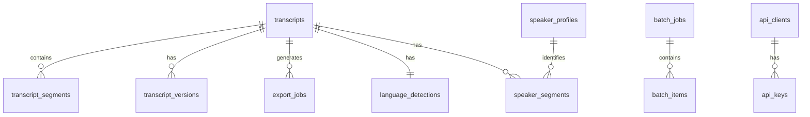

# DDD Tactical Design - Feature 3: New Features

**Version:** 1.0.0
**Date:** 2026-02-03

## Overview

This directory contains Domain-Driven Design tactical documentation for Feature 3, defining aggregates, entities, value objects, repositories, and database schemas for each bounded context.

## Documents

| Document | Description |
|----------|-------------|
| [export-context.md](./export-context.md) | Export bounded context tactical design |
| [detection-context.md](./detection-context.md) | Language Detection context design |
| [search-context.md](./search-context.md) | Global Search context design |
| [editing-context.md](./editing-context.md) | Transcript Editing context design |
| [diarization-context.md](./diarization-context.md) | Speaker Diarization context design |
| [version-context.md](./version-context.md) | Version History context design |
| [batch-context.md](./batch-context.md) | Batch Processing context design |
| [api-context.md](./api-context.md) | API Access context design |
| [database-schema.sql](./database-schema.sql) | Complete database schema |

## Aggregates Summary

### Core Aggregates

| Aggregate | Root Entity | Key Operations | Context |
|-----------|-------------|----------------|---------|
| **Transcript** | Transcript | edit, save, export | Transcript Editing |
| **DetectedLanguage** | Language | detect, confirm, fallback | Language Detection |
| **SearchQuery** | Query | execute, filter, paginate | Global Search |
| **ExportJob** | ExportJob | create, process, complete | Export |
| **SpeakerProfile** | SpeakerProfile | create, merge, label | Speaker Diarization |
| **VersionChain** | TranscriptVersion | snapshot, compare, restore | Version History |
| **BatchJob** | BatchJob | enqueue, process, complete | Batch Processing |

## Tactical Patterns

### Aggregate Design Rules

1. **Consistency Boundary:** One transaction per aggregate
2. **Size Limit:** Maximum 7 entities per aggregate
3. **External References:** By ID only, no object references
4. **Event Emission:** Aggregate emits events on state changes

### Repository Pattern

Each aggregate has a corresponding repository:

```python
# Python interface example
class TranscriptRepository(ABC):
    @abstractmethod
    async def find_by_id(self, id: TranscriptId) -> Optional[Transcript]:
        pass

    @abstractmethod
    async def save(self, transcript: Transcript) -> None:
        pass

    @abstractmethod
    async def find_by_user(self, user_id: UserId) -> List[Transcript]:
        pass
```

### Value Object Immutability

All value objects are immutable:

```python
@dataclass(frozen=True)
class DetectedLanguage:
    code: str  # ISO 639-1
    name: str
    confidence: float

    def __post_init__(self):
        if self.confidence < 0 or self.confidence > 1:
            raise ValueError("Confidence must be between 0 and 1")
```

### Domain Event Emission

Aggregates emit events when state changes:

```python
class Transcript:
    def edit_segment(self, segment_id: SegmentId, new_text: str) -> None:
        # Business logic
        self._update_segment(segment_id, new_text)

        # Emit event
        self._record_event(
            TranscriptSegmentEdited(
                transcript_id=self.id,
                segment_id=segment_id,
                original_text=old_text,
                edited_text=new_text
            )
        )
```

## Database Schema Summary

### Tables by Context

| Context | Tables |
|---------|--------|
| Export | `export_jobs`, `export_templates` |
| Detection | `language_detections`, `detection_samples` |
| Search | `search_queries`, `search_results` (cached) |
| Editing | `transcripts`, `transcript_segments`, `edit_sessions` |
| Diarization | `speaker_profiles`, `speaker_segments` |
| Version | `transcript_versions`, `version_diffs` |
| Batch | `batch_jobs`, `batch_items` |
| API | `api_keys`, `api_clients`, `api_requests` |

### Key Relationships



## Implementation Guidelines

### Folder Structure

```
backend/app/
├── contexts/
│   ├── export/
│   │   ├── __init__.py
│   │   ├── domain/
│   │   │   ├── aggregates.py
│   │   │   ├── entities.py
│   │   │   └── value_objects.py
│   │   ├── application/
│   │   │   ├── services.py
│   │   │   └── dto.py
│   │   └── infrastructure/
│   │       ├── repositories.py
│   │       └── mappers.py
│   ├── detection/
│   ├── search/
│   ├── editing/
│   ├── diarization/
│   ├── version/
│   ├── batch/
│   └── api/
└── shared/
    ├── domain/
    │   ├── events.py
    │   └── base.py
    └── infrastructure/
        └── database.py
```

### Testing Strategy

1. **Unit Tests:** Test aggregate business logic in isolation
2. **Integration Tests:** Test repository implementations
3. **Contract Tests:** Test cross-context communication
4. **E2E Tests:** Test complete user journeys

## Quick Reference

### Common Value Objects

| VO | Properties | Validation |
|----|------------|------------|
| `TimeRange` | start: float, end: float | end > start |
| `ConfidenceScore` | value: float | 0 <= value <= 1 |
| `LanguageCode` | code: str | Valid ISO 639-1 |
| `ExportFormat` | format: str | In supported formats |

### Common Domain Events

| Event | When Emitted | Payload |
|-------|--------------|---------|
| `TranscriptCreated` | New transcript | transcriptId, language |
| `LanguageDetected` | Detection complete | language, confidence |
| `ExportCompleted` | Export ready | exportJobId, fileUrl |
| `TranscriptEdited` | Segment edited | segmentId, changes |
| `VersionCreated` | Version snapshot | versionId, changes |

## Next Steps

After understanding tactical design:
1. Review [C4 Diagrams](../../c4/) for component architecture
2. Check [Pseudocode](../../pseudocode/) for algorithm specifications
3. Review [ADR Catalog](../../adr/) for technical decisions
