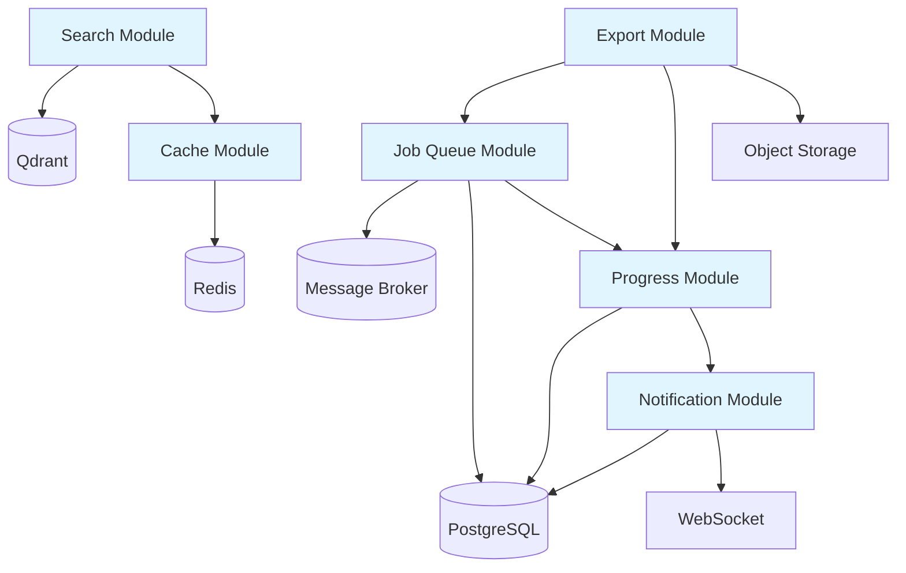

# Module Dependencies Documentation

This document describes the dependencies between modules, features, and infrastructure components in the modular implementation.

## Overview

```
                    Infrastructure Layer
    +--------+  +-------+  +--------+  +--------+
    |  DB    |  | Redis |  | Qdrant |  | Broker |
    +--------+  +-------+  +--------+  +--------+
          |          |          |          |
          +----------+----------+----------+
                     |
           +-------------------+
           |  Module Layer     |
           +-------------------+
    +---------+  +------+  +----+  +-----+
    |Progress |  | Job  |  |Cache|  |Search|
    +---------+  +Queue |  +----+  +-----+
          |          |        |        |
          +----------+--------+--------+
                     |
           +-------------------+
           | Feature Layer      |
           +-------------------+
    +---------+  +------+  +----+  +-----+
    |Feature1|  |Feat 2|  |Feat3|  | ... |
    +---------+  +------+  +----+  +-----+
```

---

## Infrastructure Dependencies

### Core Infrastructure

| Component | Purpose | Required By |
|-----------|---------|-------------|
| **PostgreSQL** | Primary database | Progress, Notification, Job Queue, Export |
| **Redis** | Cache & Message Broker | Cache, Job Queue, Sessions |
| **Qdrant** | Vector Database | Search |
| **WebSocket Server** | Real-time communication | Progress, Notification |
| **Object Storage** | File storage | Export (S3/GCS/local) |

### Optional Infrastructure

| Component | Purpose | Used By |
|-----------|---------|---------|
| **RabbitMQ** | Alternative message broker | Job Queue |
| **Memcached** | Alternative cache | Cache |
| **Elasticsearch** | Full-text search | Search (hybrid) |
| **SendGrid/SES** | Email sending | Notification |
| **Firebase** | Push notifications | Notification |

---

## Module Dependencies

### Dependency Graph



### Module-to-Module Dependencies

| Module | Depends On | Description |
|--------|------------|-------------|
| **Progress** | None | Core module, no dependencies |
| **Notification** | None | Can work standalone |
| **Cache** | None | Standalone caching layer |
| **Job Queue** | Cache (optional), Progress (optional) | Uses cache for optimization, progress for tracking |
| **Export** | Job Queue, Progress, Cache | Requires job queue for async, progress for tracking, cache for optimization |
| **Search** | Cache (optional) | Uses cache for query results |

### Module-to-Infrastructure Dependencies

| Module | Infrastructure | Required |
|--------|----------------|----------|
| **Progress** | PostgreSQL | Yes |
| **Progress** | WebSocket | Optional (for real-time) |
| **Notification** | PostgreSQL | Optional (for persistence) |
| **Notification** | WebSocket | Yes |
| **Notification** | SendGrid/SES | Optional (for email) |
| **Cache** | Redis | Yes (or alternative) |
| **Cache** | Memory | Optional (for L1 cache) |
| **Job Queue** | Redis/RabbitMQ | Yes |
| **Job Queue** | PostgreSQL | Yes |
| **Export** | S3/GCS | Yes |
| **Export** | Template engine | Optional |
| **Search** | Qdrant | Yes |
| **Search** | OpenAI/Cohere | Yes (for embeddings) |
| **Search** | Cache | Optional |

---

## Feature Dependencies

### Feature 1: Progress Tracking & Notifications

```
Feature 1 (UI/UX Improvements)
    |
    +-- Progress Tracking Module
    |       |
    |       +-- PostgreSQL (progress storage)
    |       +-- WebSocket (real-time updates)
    |
    +-- Notification Module
    |       |
    |       +-- WebSocket (delivery)
    |       +-- PostgreSQL (persistence)
    |       +-- SendGrid (email - optional)
```

**Dependencies:**
- Progress Module (required)
- Notification Module (required)
- PostgreSQL (required)
- WebSocket Server (required)

**Data Flow:**
1. User initiates action (file upload, transcription)
2. Progress Module creates progress tracker
3. Progress updates broadcast via WebSocket
4. On completion, Notification Module sends notification
5. Client receives both progress and notification updates

### Feature 2: Performance Optimization

```
Feature 2 (Performance)
    |
    +-- Job Queue Module
    |       |
    |       +-- Redis/RabbitMQ (broker)
    |       +-- PostgreSQL (job storage)
    |       +-- Progress Module (tracking)
    |
    +-- Cache Module
    |       |
    |       +-- Redis (L2 cache)
    |       +-- Memory (L1 cache)
    |
    +-- Large File Handling
    |       |
    |       +-- Job Queue (async processing)
    |       +-- Progress Module (real-time feedback)
    |       +-- Chunked Upload (infrastructure)
```

**Dependencies:**
- Job Queue Module (required)
- Cache Module (required)
- Progress Module (required)
- Redis (required)
- PostgreSQL (required)

**Data Flow:**
1. Large file uploaded in chunks
2. Job Queue enqueues processing job
3. Progress Module tracks chunking and processing
4. Cache Module stores intermediate results
5. Results cached for quick retrieval

### Feature 3: Advanced Features

```
Feature 3 (Search & Export)
    |
    +-- Search Module
    |       |
    |       +-- Qdrant (vector DB)
    |       +-- OpenAI/Cohere (embeddings)
    |       +-- Cache Module (query cache)
    |
    +-- Export Module
    |       |
    |       +-- Job Queue Module (async export)
    |       +-- Progress Module (export progress)
    |       +-- S3/GCS (file storage)
    |       +-- Template Engine (custom formats)
```

**Dependencies:**
- Search Module (required)
- Export Module (required)
- Cache Module (optional, for search)
- Job Queue Module (required, for export)
- Progress Module (required, for export)
- Qdrant (required, for search)
- S3/GCS (required, for export)

**Data Flow:**
1. User performs search
2. Search Module queries Qdrant with embeddings
3. Results cached in Cache Module
4. User requests export
5. Export Module creates job via Job Queue
6. Progress Module tracks export progress
7. Export stored in S3/GCS

---

## Implementation Order

### Phase 0: Foundation (Week 0-1)

**Order:**
1. Set up Docker Compose with infrastructure
2. Configure PostgreSQL
3. Configure Redis
4. Configure Qdrant (if using Search)
5. Set up WebSocket server

**Dependencies:**
- None (infrastructure setup)

### Phase 1: Core Modules (Week 1-2)

**Order:**
1. **Cache Module** (no dependencies, foundation for others)
2. **Progress Module** (no dependencies)
3. **Notification Module** (no dependencies)

**Dependencies:**
- Cache Module requires Redis
- Progress Module requires PostgreSQL
- Notification Module requires WebSocket

### Phase 2: Processing Layer (Week 3-4)

**Order:**
1. **Job Queue Module** (depends on Cache)
2. **Export Module** (depends on Job Queue, Progress)
3. **Search Module** (depends on Cache)

**Dependencies:**
- Job Queue Module requires Redis, PostgreSQL, optional Cache
- Export Module requires Job Queue, Progress, Storage
- Search Module requires Qdrant, optional Cache

### Phase 3: Features (Week 5-7)

**Order:**
1. **Feature 1** (Progress + Notifications)
2. **Feature 2** (Job Queue + Cache)
3. **Feature 3** (Search + Export)

**Dependencies:**
- Feature 1 requires Progress, Notification
- Feature 2 requires Job Queue, Cache, Progress
- Feature 3 requires Search, Export, Job Queue, Progress

---

## Dependency Matrices

### Module Dependency Matrix

| | Progress | Notification | Cache | JobQueue | Export | Search |
|---|---|---|---|---|---|---|
| **Progress** | - | None | None | None | None | None |
| **Notification** | None | - | None | None | None | None |
| **Cache** | None | None | - | Optional | Optional | Optional |
| **JobQueue** | Optional | None | Optional | - | Required | None |
| **Export** | Required | None | Optional | Required | - | None |
| **Search** | None | None | Optional | None | None | - |

### Infrastructure Dependency Matrix

| | PostgreSQL | Redis | Qdrant | WebSocket | S3/GCS | Email |
|---|---|---|---|---|---|---|
| **Progress** | Required | Optional | None | Optional | None | None |
| **Notification** | Optional | None | None | Required | None | Optional |
| **Cache** | None | Required | None | None | None | None |
| **JobQueue** | Required | Required | None | None | None | None |
| **Export** | Required | None | None | None | Required | None |
| **Search** | None | Optional | Required | None | None | None |

### Feature Dependency Matrix

| | ProgModule | NotifModule | CacheModule | JQModule | ExportModule | SearchModule |
|---|---|---|---|---|---|---|
| **Feature 1** | Required | Required | None | None | None | None |
| **Feature 2** | Required | None | Required | Required | None | None |
| **Feature 3** | Required | None | Optional | Required | Required | Required |

---

## Circular Dependencies

### Potential Circularity

There are **no circular dependencies** in the current design. The dependency graph is a Directed Acyclic Graph (DAG).

### Prevention Strategy

1. **Interface Segregation**: Modules depend on interfaces, not implementations
2. **Dependency Injection**: Inject dependencies rather than hard-coding
3. **Event-Driven**: Use events to decouple modules
4. **Optional Dependencies**: Make some dependencies optional

### Example: Avoiding Circularity

**Bad (creates circular dependency):**
```python
# JobQueue depends on Progress
class JobQueue:
    def __init__(self, progress: Progress):
        self.progress = progress

# Progress depends on JobQueue (for updates)
class Progress:
    def __init__(self, job_queue: JobQueue):
        self.job_queue = job_queue
```

**Good (uses events to break cycle):**
```python
# JobQueue emits events
class JobQueue:
    def __init__(self, event_bus: EventBus):
        self.event_bus = event_bus

    async def complete_job(self, job):
        await self.event_bus.emit("job.completed", job)

# Progress listens to events
class Progress:
    def __init__(self, event_bus: EventBus):
        self.event_bus = event_bus
        event_bus.subscribe("job.completed", self.on_job_completed)
```

---

## Version Compatibility

### Module Versions

| Module Version | Compatible With |
|----------------|-----------------|
| Progress 1.x | Cache 1.x+, Notification 1.x+ |
| Notification 1.x | Progress 1.x+ |
| Cache 1.x | All modules |
| Job Queue 1.x | Cache 1.x+, Progress 1.x+ |
| Export 1.x | Job Queue 1.x+, Progress 1.x+, Cache 1.x+ |
| Search 1.x | Cache 1.x+ |

### Infrastructure Versions

| Component | Minimum Version | Recommended Version |
|-----------|-----------------|---------------------|
| PostgreSQL | 12 | 15 |
| Redis | 6 | 7 |
| Qdrant | 1.0 | 1.7+ |
| Python | 3.10 | 3.11 |
| Node.js | 18 | 20 |

---

## Migration Path

### Adding Modules Incrementally

**Step 1: Start with Cache**
```python
# Add cache to existing application
cache = RedisCache(url="redis://localhost:6379")

# Wrap existing functions
@cached(cache)
async def get_user(user_id):
    return await db.query(User).get(user_id)
```

**Step 2: Add Progress Tracking**
```python
# Add progress to long-running operations
progress = ProgressTracker(storage=db_storage)

async def process_file(file_id):
    tracker = await progress.create(id=file_id, stages=["upload", "process"])
    # ... processing with updates
```

**Step 3: Add Job Queue**
```python
# Migrate synchronous processing to async
queue = JobQueue(broker=redis_broker)

# Replace direct calls with jobs
# Before: result = await process(data)
# After: job = await queue.enqueue("process", {"data": data})
```

### Removing Dependencies

**To remove a module:**

1. **Identify dependents**: Check which modules/features use it
2. **Create abstraction**: Add interface layer
3. **Replace implementation**: Swap with alternative
4. **Test thoroughly**: Ensure no breaking changes

**Example: Replacing Redis with Memcached**

```python
# Before
cache = RedisCache(url="redis://localhost:6379")

# Create interface
class CacheBackend(ABC):
    @abstractmethod
    async def get(self, key): pass
    @abstractmethod
    async def set(self, key, value): pass

# Both implement same interface
class RedisCache(CacheBackend): ...
class MemcachedCache(CacheBackend): ...

# Swap without changing application code
cache = MemcachedCache(servers=["localhost:11211"])
```

---

## Dependency Testing

### Integration Test Order

1. **Unit Tests**: Test each module in isolation
2. **Pair Tests**: Test module pairs that depend on each other
3. **Feature Tests**: Test complete features
4. **End-to-End Tests**: Test entire application

### Test Dependencies

```python
# Test fixtures with proper setup/teardown
@pytest.fixture
async def cache():
    cache = RedisCache(url="redis://localhost:6379/15")  # DB 15 for tests
    await cache.clear()
    yield cache
    await cache.clear()

@pytest.fixture
async def progress(cache):
    storage = PostgreSQLProgressStorage(test_db_url)
    tracker = ProgressTracker(storage=storage)
    yield tracker
    # Cleanup

# Tests that use both fixtures
async def test_job_queue_with_progress(progress, cache):
    queue = JobQueue(broker=redis_broker, progress=progress, cache=cache)
    # Test...
```

---

## Dependency Health Checks

### Health Check Endpoints

```python
# /health/dependencies
{
  "status": "healthy",
  "dependencies": {
    "postgresql": {"status": "healthy", "latency_ms": 2},
    "redis": {"status": "healthy", "latency_ms": 1},
    "qdrant": {"status": "healthy", "latency_ms": 5},
    "websocket": {"status": "healthy"}
  },
  "modules": {
    "progress": {"status": "healthy"},
    "notification": {"status": "healthy"},
    "cache": {"status": "healthy"},
    "job_queue": {"status": "healthy"},
    "export": {"status": "healthy"},
    "search": {"status": "healthy"}
  }
}
```

### Graceful Degradation

When a dependency fails:

| Dependency | Impact | Fallback |
|------------|--------|----------|
| Redis | Cache, Job Queue fail | Use memory cache, queue locally |
| PostgreSQL | Data persistence lost | Use in-memory storage |
| Qdrant | Search unavailable | Return error, disable search |
| WebSocket | Real-time updates lost | Fall back to polling |
| S3/GCS | Export storage lost | Use local filesystem |

---

## Dependency Management Best Practices

1. **Minimize Dependencies**: Only depend on what's essential
2. **Use Interfaces**: Depend on abstractions, not implementations
3. **Version Pinning**: Pin dependency versions in production
4. **Regular Updates**: Update dependencies for security patches
5. **Monitor Dependencies**: Track dependency health
6. **Plan for Failure**: Design for graceful degradation
7. **Document Dependencies**: Keep this document updated

---

## Quick Reference

### Module Installation Order

1. Cache (foundation)
2. Progress (core functionality)
3. Notification (user communication)
4. Job Queue (async processing)
5. Export (depends on Job Queue, Progress)
6. Search (depends on Cache)

### Infrastructure Startup Order

```bash
# Start infrastructure in this order
docker-compose up -d postgresql redis
docker-compose up -d qdrant
docker-compose up -d app
```

### Feature Implementation Order

1. Feature 1 (Progress + Notifications) - Week 1-3
2. Feature 2 (Job Queue + Cache) - Week 3-5
3. Feature 3 (Search + Export) - Week 5-7
